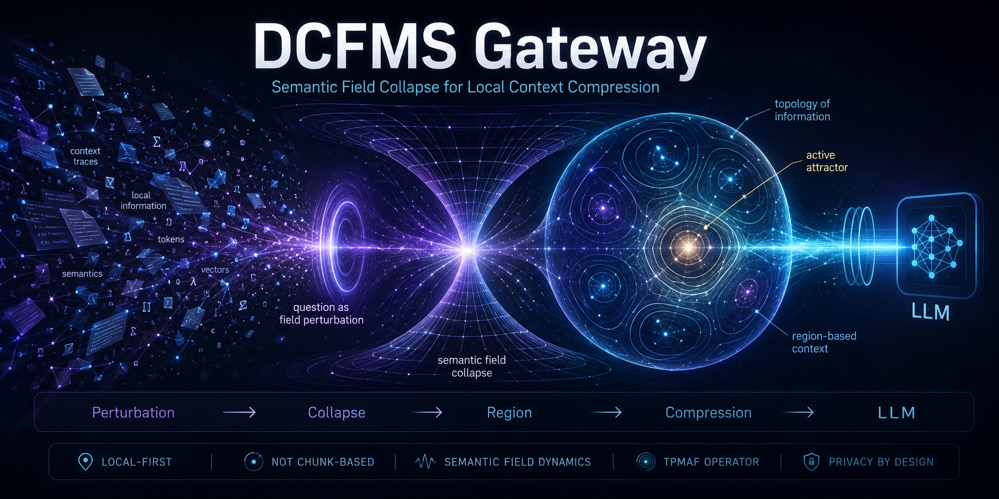

  

<h1 align="center">DCFMS Gateway</h1>

  <strong>Semantic Field Collapse for Local Context Compression</strong>

  Local-first context compression layer for LLM workflows.

---

## What is DCFMS Gateway?

DCFMS Gateway is an experimental context-reduction layer for Large Language Model workflows.

Instead of sending an entire corpus to an LLM, the system selects and compresses the most relevant context before inference.

The goal is to reduce token usage, reduce data exposure, and preserve answer quality.

# DCFMS Gateway

DCFMS Gateway is an experimental context-reduction layer for Large Language Model workflows.

It is designed to reduce:

- token usage,
- context noise,
- data exposure,
- LLM operating cost,

while preserving answer quality.

## Official Publication

The full whitepaper is published on Zenodo:

**DCFMS Gateway: Context Compression and Data Exposure Reduction for Large Language Model Workflows**

**DOI:** 10.5281/zenodo.20746841

**Zenodo Record:**  
https://zenodo.org/records/20746841

### Supplementary Technical Note
DCFMS Gateway Supplementary Technical Note: Semantic Field Localization, Active Attractors, Region Coordinates and Context Construction

https://zenodo.org/records/20751660

## Key Results

| Metric | Result |
|---|---:|
| Compression ratio | up to 119.93x |
| Noise removed | up to 98.61% |
| Full20 OFF/ON | 20/0/0 → 20/0/0 |
| Client Demo improvement | 17/0/3 → 18/1/1 |
| Ordered Context improvement | 3/2/15 → 10/1/9 |
| Validation status | Internal benchmarks only |

## Scope

This repository is only a public landing page for the DCFMS Gateway publication.

It does not include:

- source code,
- implementation details,
- private datasets,
- internal project files,
- benchmark raw data.

## Project Website

https://gateway.echozeroops.com

## Contact

echozero@riseup.net  
3echo@riseup.net

## License

This work is licensed under the Creative Commons Attribution-NonCommercial 4.0 International License (CC BY-NC 4.0).

https://creativecommons.org/licenses/by-nc/4.0/
