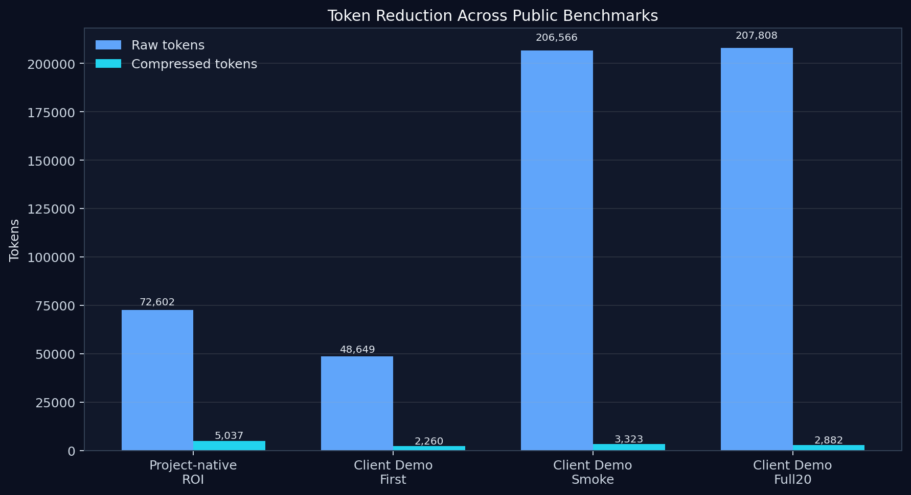
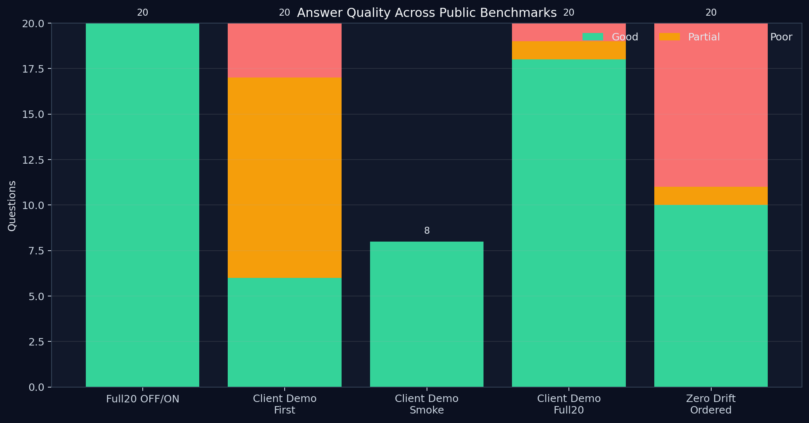
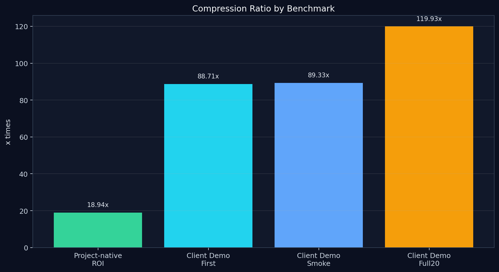
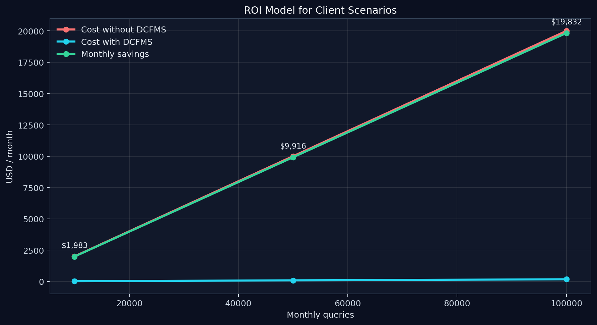

# DCFMS Gateway Whitepaper v1

## Abstract

DCFMS Gateway is a semantic compression platform for LLM workflows.  
Its purpose is to reduce the amount of text sent to the model while keeping the answer grounded in the most relevant source material.

The practical benefit is measurable: less input means lower cost, better filtering means less noise, and more focused context increases the chance that the answer stays within the corpus.

This whitepaper summarizes the public-facing problem, methodology, benchmark evidence, ROI, and product status. It intentionally avoids implementation detail.

## 1. The problem

Most LLM cost comes from context, not from the answer itself.  
In real workflows, documents are long, source sets are noisy, and many questions only depend on a small fraction of the available material.

That creates three problems:

1. **Cost inflation** - long prompts burn tokens.
2. **Quality drift** - irrelevant context can reduce answer precision.
3. **Control risk** - teams lose visibility into what information the model actually uses.

DCFMS Gateway addresses these problems by compressing the context before it reaches the model.

## 2. Methodology

The project evaluates performance in a repeatable way:

- measure raw input size,
- compress the source context,
- compare token counts before and after,
- measure compression ratio,
- estimate noise removed,
- assess answer quality using `good / partial / poor`,
- verify whether answers stay grounded in the intended corpus,
- track whether out-of-corpus questions are safely rejected.

This methodology is used across:

- project-native tests,
- client-demo tests,
- laboratory research benchmarks.

## Privacy and Data Minimization

DCFMS Gateway minimizes the amount of information sent to the model by compressing the source corpus into a smaller, selected context.  
This means the full corpus can remain on the user side while only the relevant subset is forwarded for inference.

The practical effect is reduced data exposure compared with sending entire documents or complete source collections to the model.

Key points:

- local corpus retention stays with the user,
- only selected and compressed context is sent to the model,
- token reduction also reduces the amount of data transmitted,
- the system narrows the prompt surface by avoiding full-document forwarding.

These statements describe the current behavior of the system; they do not imply formal privacy certification or compliance status.

## 3. Benchmark evidence

### 3.1 Gateway baseline

The Full20 OFF/ON comparison showed:

- OFF: `20/0/0`
- ON: `20/0/0`
- regressions: `0`
- improvements: `0`

Interpretation: the compressed path preserved quality in this benchmark and did not worsen answer correctness.

## Figures

### Token reduction

### Answer quality

### Compression ratio

### ROI estimate

### 3.2 Token compression and ROI

The project-native compression benchmark reported:

- average raw tokens: `72,602.3`
- average compressed tokens: `5,037.05`
- average compression ratio: `18.94x`
- average noise removed: `93.06%`

These numbers are measured from benchmark runs and show the amount of context reduction achieved by the system.

### 3.3 Client Demo V1

The FastAPI client corpus benchmark showed that the system can operate on an external, client-provided knowledge base.

Key results:

- initial 20-question benchmark: `6/11/3`
- smoke after corpus improvement: `8/0/0`
- full 20-question run after patch: `18/1/1`
- final patch plateau: `17/0/3`

Interpretation:

- the corpus matters,
- guard logic matters,
- the system can become highly reliable on a focused client corpus,
- out-of-corpus handling is part of the value proposition.

### 3.4 Laboratory benchmarks

Laboratory research on Zero Drift showed how contextual ordering can change outcomes in a controlled setting:

- ordered-context benchmark: `3/2/15` -> `10/1/9`
- representative adapter benchmark: `10/1/9` -> `6/2/12`

These are useful research signals, but they are not the public product target.

## 4. Answer quality

The product is not judged only by token savings.  
It must also preserve answer usefulness.

The public evidence shows:

- high-quality answers on targeted corpora,
- safe refusal for out-of-corpus queries,
- no regression in the baseline OFF/ON comparison,
- improved results after corpus tuning.

That combination matters because a cheaper answer is not useful if it is wrong.

## 5. ROI

The existing ROI model demonstrates a strong business case.

### 5.1 Measured signals

- `18.94x` compression on the project-native ROI benchmark
- `93.06%` noise removed on the project-native ROI benchmark
- `118.66x` compression in the client demo benchmark

### 5.2 Estimated scenario model

These values are model-based estimates derived from token usage and assumed pricing:

- **Small Business**
  - 10,000 monthly queries
  - cost without DCFMS: `$2,000.00`
  - cost with DCFMS: `$16.85`
  - monthly savings: `$1,983.15`
  - yearly savings: `$23,797.80`

- **Medium Business**
  - 50,000 monthly queries
  - cost without DCFMS: `$10,000.00`
  - cost with DCFMS: `$84.25`
  - monthly savings: `$9,915.75`
  - yearly savings: `$118,989.00`

- **Enterprise**
  - 100,000 monthly queries
  - cost without DCFMS: `$20,000.00`
  - cost with DCFMS: `$168.50`
  - monthly savings: `$19,831.50`
  - yearly savings: `$237,978.00`

The conclusion is straightforward: the larger the monthly usage and the larger the source corpus, the stronger the savings.

## 6. Independent Validation Status

Results presented here come from internal project benchmarks and have not yet undergone independent third-party verification.

That means:

- the numbers are real internal results,
- the methodology is documented,
- but external validation is still pending.

This is the correct level of confidence for a public release at this stage.

## 7. Limitations

Important limitations to keep in mind:

- benchmark results are internal project benchmarks,
- some results are dataset-specific,
- client demo results reflect the FastAPI corpus used in testing,
- ROI values depend on the chosen token-price assumption,
- laboratory benchmarks are not product baselines,
- no independent third-party verification has been completed yet.

## 8. What this is not

DCFMS Gateway is not:

- a replacement for an LLM,
- a claim that every answer will be perfect,
- a guarantee of zero risk,
- a statement that all corpora behave identically.

It is a compression and control layer that helps make LLM usage more efficient and more governed.

## 9. Conclusion

The public evidence supports a clear product narrative:

1. DCFMS Gateway reduces token usage dramatically.
2. It can keep answer quality stable in benchmarked scenarios.
3. It provides a practical ROI story.
4. It improves the handling of client-owned corpora.
5. It is already past the stage of a pure technical experiment.

The next logical step is customer pilots on real external corpora with business stakeholders who care about cost, answer quality, and control.

## Publication

DOI: `10.5281/zenodo.20746841`

Zenodo: [https://zenodo.org/records/20746841](https://zenodo.org/records/20746841)
